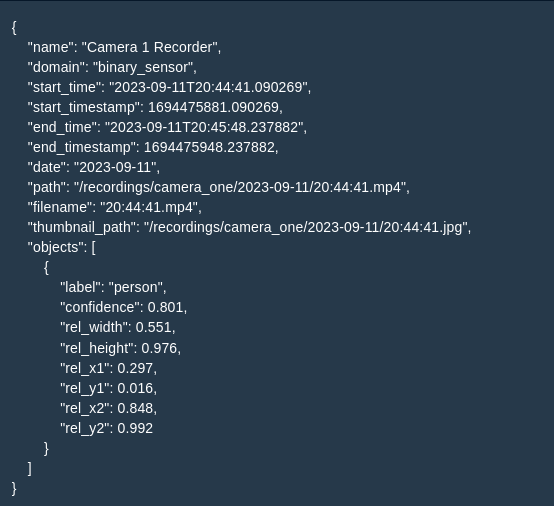
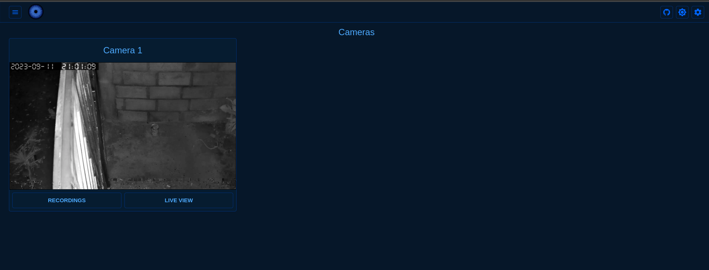

### Monitoramento inteligente

Esse projeto foi desenvolvido utilizando o [Viseron](https://viseron.netlify.app/). A aplicação é utilizada para gravar pessoas e carros quando um desses objetos forem identificados. 

Para mais detalhes de desenvolvimento, basta seguir a documenação apresentada em [Viseron](https://viseron.netlify.app/).

#### Classificação de entidade

#### Gravações salvas
!